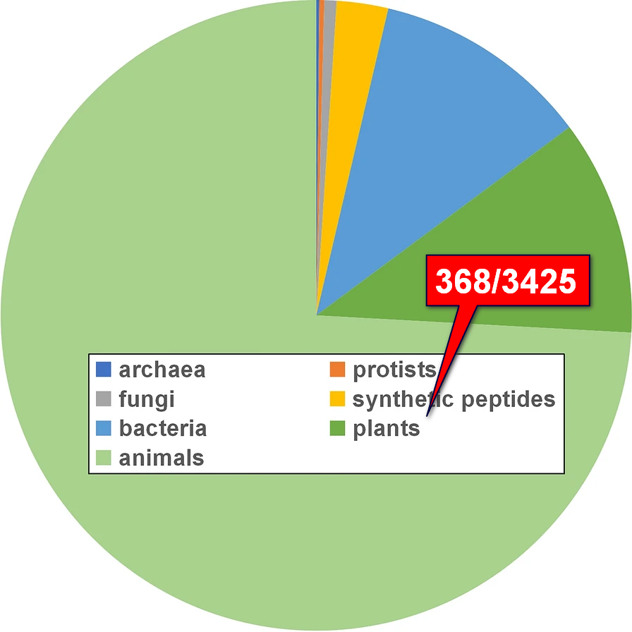
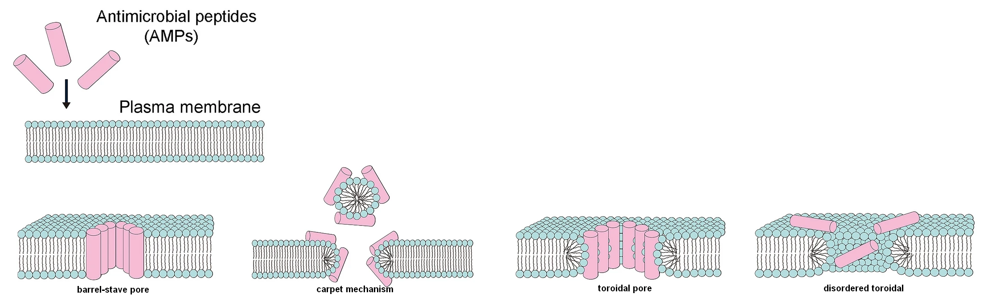

class: middle, center
background-image: url(img/pp630507.f1.jpeg)
background-size: contain

# The Translation Turnover during Seed Germination

---

# The Plant Peptidome

```{r, out.width = "95%", fig.align='center', fig.cap='Tavormina, et al. 2015. The Plant Cell. 27(8): 2095-2118'}

```

???

< 100 aa, usually 2-50 aa

precursor derived

non-precursor derived

---

# Anti-Microbial Peptides (AMPs)

.pull-left-30[
```{r, out.width = "100%"}

```
]

.pull-right-70[

<br>

- normally 2~50 aa (2-10 kDa)

<br>

- usually positively charged, containing cys (disulfide bonds)

<br>

- existed in humans, animals, plants (368/3425 in APD database)

]

```{r, out.width = "100%", fig.align='center', fig.cap='Li, et al. 2021. Botanical Stuides. 62(1): 5'}

```

???

more general, usually positively charged
Barrel‑stave pore 
Carpet mechanism 
Toroidal pore 
Disordered toroidal pore 

---

class: inverse, center, middle

# Objectif: 

.left[

- Modelisation for Identification of new AMPs

- AMPs dynamics & biotic stress response during germination

- Potential applicability for 
  - agricultural industry
  - food additives 
  - disease treatments
]

---

background-image: url(img/Training_Set_in_Table.svg)
background-size: contain

# The *in silico* study of AMPs
