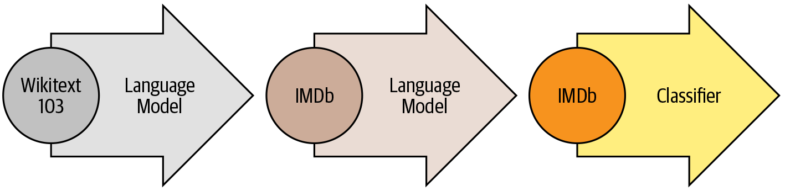

# Deep Learning AMPs prediction: L'approach 'de bout en bout'

```{r, out.width = "150%", fig.align='center'}
knitr::include_graphics("img/Training Set in Table2.svg")
```

???

neuron network 

---

# Transfer learning -- create reusable model

```{r, out.width = "80%", fig.align='center', fig.cap='Tunstall, et al. 2022. NLP with Transformers. Chapter 1.'}

```

---

# Language Model: self-supervised learning on NLP

```{r, out.width = "80%", fig.align='center', fig.cap='Ofer, et al. 2021. Comp and Struc Biotech J. 19: 1750-1758'}
knitr::include_graphics("img/1-s2.0-S2001037021000945-gr2_lrg.jpg")
```

```{r, out.width = "80%", fig.align='center', fig.cap='Tunstall, et al. 2022. NLP with Transformers. Chapter 1.'}

```

---

class: middle, center
background-image: url(img/2022-11-07_110523.png)
background-size: contain


???
https://blog.salesforceairesearch.com/learning-from-evolution/
# ProtTrans
- 393 billion amino acid
- The Summit supercomputer using 5616 GPUs and TPU Pod up-to 1024 cores

---

class: left, bottom
background-image: url(img/degerm.svg)
background-size: contain

# What I want to do next

---

class: center

# The origin of Language/Life

```{r, out.width = "55%", fig.align='center', fig.cap='La Confusion des langues, Gustave Doré.'}

```
